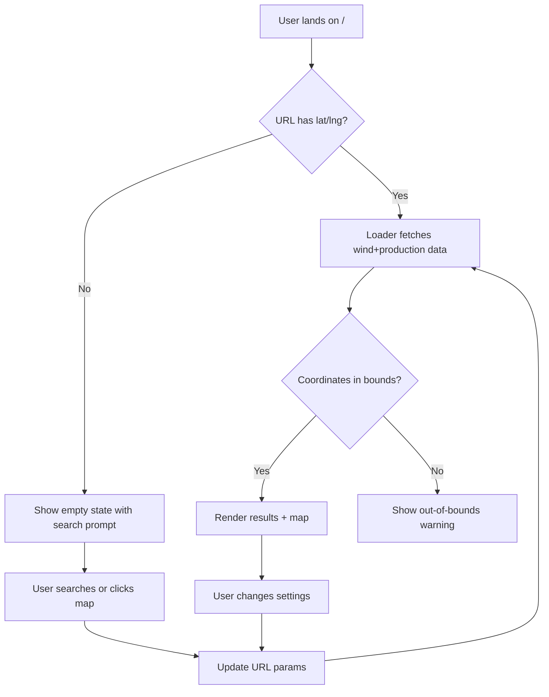

# WindWatts UI → Remix SSR Migration Plan

## Executive Summary

Migrate the current WindWatts React SPA to a Remix SSR application with:

- **Primary Goal**: Hide API layer behind SSR proxy (security)
- **Secondary Goals**: URL-first state, SEO, shareable links, simplified architecture
- **Timeline**: 4-6 weeks fast-track MVP with feature parity
- **Approach**: Phased development with iterative testing, single cutover deployment
- **UI Standard**: Functional parity prioritized over pixel-perfect matching

---

## 1. Complete Component & Feature Inventory

### 1.1 Page Routes

| Name          | Type  | Path | SSR Ready | Mobile Variant | Notes                                   |

| ------------- | ----- | ---- | --------- | -------------- | --------------------------------------- |

| Home/Map View | Route | `/`  | ✅        | ✅             | Single route app, lat/lng in URL params |

### 1.2 Layout Components

| Name          | File                             | Used By | Client-Only | SSR Risk | Migration Notes                              |

| ------------- | -------------------------------- | ------- | ----------- | -------- | -------------------------------------------- |

| Layout        | `Layout.tsx`                     | Root    | ❌          | Low      | Media query wrapper, split desktop/mobile    |

| LayoutDesktop | `desktop-view/LayoutDesktop.tsx` | Layout  | ❌          | Low      | App bar + sidebar layout                     |

| LayoutMobile  | `mobile-view/LayoutMobile.tsx`   | Layout  | ❌          | Low      | App bar + bottom sheet                       |

| AppProviders  | `providers/AppProviders.tsx`     | Root    | ❌          | Low      | Context providers, migrate to Remix patterns |

### 1.3 Core Interactive Components

| Name              | File                                         | Type      | Client-Only | SSR Risk | Dependencies              | Migration Strategy               |

| ----------------- | -------------------------------------------- | --------- | ----------- | -------- | ------------------------- | -------------------------------- |

| MapViewDesktop    | `desktop-view/MapViewDesktop.tsx`            | Page      | ✅          | High     | Google Maps, geolocation  | Client-side hydration boundary   |

| MapViewMobile     | `mobile-view/MapViewMobile.tsx`              | Page      | ✅          | High     | Google Maps, geolocation  | Client-side hydration boundary   |

| SearchBar         | `core/SearchBar.tsx`                         | Component | ✅          | High     | Google Places API         | Client-side, needs Places script |

| MobileSearchBar   | `mobile-view/components/MobileSearchBar.tsx` | Component | ✅          | High     | Google Places API         | Client-side component            |

| MobileBottomSheet | `mobile-view/MobileBottomSheet.tsx`          | Component | ✅          | Medium   | Touch events, DOM queries | Client-side with ref forwarding  |

| Settings          | `settings/Settings.tsx`                      | Modal     | ❌          | Low      | MUI Modal                 | Server-renderable with URL sync  |

### 1.4 Result Display Components

| Name                | File                                 | SSR Ready | Data Source            | Migration Notes                  |

| ------------------- | ------------------------------------ | --------- | ---------------------- | -------------------------------- |

| RightPane           | `resultPane/RightPane.tsx`           | ✅        | Context + URL          | Loader data prop, remove context |

| AnalysisResults     | `resultPane/AnalysisResults.tsx`     | ✅        | Hooks                  | Pass loader data as props        |

| ProductionCard      | `resultPane/ProductionCard.tsx`      | ✅        | useProductionData hook | Convert to loader data prop      |

| WindSpeedCard       | `resultPane/WindSpeedCard.tsx`       | ✅        | useWindData hook       | Convert to loader data prop      |

| WindResourceCard    | `resultPane/WindResourceCard.tsx`    | ✅        | useWindData hook       | Convert to loader data prop      |

| EnsembleTiles       | `resultPane/EnsembleResultsCard.tsx` | ✅        | useEnsembleTilesData   | Convert to loader data prop      |

| ProductionDataTable | `resultPane/ProductionDataTable.tsx` | ✅        | Props                  | Already prop-based, keep as-is   |

| DataSourceLinks     | `resultPane/DataSourceLinks.tsx`     | ✅        | Props                  | Static links, no changes needed  |

### 1.5 Settings Components

| Name                     | File                                    | SSR Ready | State Source    | Migration                              |

| ------------------------ | --------------------------------------- | --------- | --------------- | -------------------------------------- |

| HubHeightSettings        | `settings/HubHeightSettings.tsx`        | ✅        | SettingsContext | URL params + form                      |

| PowerCurveSettings       | `settings/PowerCurveSettings.tsx`       | ⚠️        | SWR API call    | Fetch in loader, pass as prop          |

| UnitsSettings            | `settings/UnitsSettings.tsx`            | ✅        | UnitsContext    | localStorage on client, default server |

| LossAssumptionSettings   | `settings/LossAssumptionSettings.tsx`   | ✅        | SettingsContext | URL params + form                      |

| ModelSettings            | `settings/ModelSettings.tsx`            | ✅        | SettingsContext | URL params + form                      |

| EnsembleSettings         | `settings/EnsembleSettings.tsx`         | ✅        | SettingsContext | URL params + form                      |

| SettingToggleButtonGroup | `settings/SettingToggleButtonGroup.tsx` | ✅        | Props           | Reusable, no changes                   |

### 1.6 Shared/Utility Components

| Name               | File                            | SSR Ready | Notes                           |

| ------------------ | ------------------------------- | --------- | ------------------------------- | ----------------------- |

| LoadingBackdrop    | `shared/LoadingBackdrop.tsx`    | ✅        | MUI Backdrop, SSR safe          |

| OutOfBoundsMarker  | `shared/OutOfBoundsMarker.tsx`  | ✅        | Google Maps marker, client-only |

| OutOfBoundsWarning | `shared/OutOfBoundsWarning.tsx` | ✅        | Static alert, SSR safe          |

| ShareButton        | `shared/ShareButton.tsx`        | ⚠️        | Uses navigator.clipboard        | Client-side interaction |

| CardStates         | `shared/CardStates.tsx`         | ✅        | Skeleton components, SSR safe   |

### 1.7 Hooks

| Name                          | File                                     | Purpose                       | Client-Only | Migration Strategy             |

| ----------------------------- | ---------------------------------------- | ----------------------------- | ----------- | ------------------------------ |

| useWindData                   | `hooks/useWindData.ts`                   | Fetch wind speed data         | ✅ (SWR)    | Replace with loader data       |

| useProductionData             | `hooks/useProductionData.ts`             | Fetch production data         | ✅ (SWR)    | Replace with loader data       |

| useEnsembleTilesData          | `hooks/useEnsembleTilesData.ts`          | Fetch ensemble data           | ✅ (SWR)    | Replace with loader data       |

| useGoogleMaps                 | `hooks/useGoogleMaps.ts`                 | Load Google Maps API          | ✅          | Keep client-side, lazy load    |

| useGeolocation                | `hooks/useGeolocation.ts`                | Browser geolocation           | ✅          | Keep client-side               |

| useLocalStorage               | `hooks/useLocalStorage.ts`               | Persist units to localStorage | ✅          | Keep client-side, SSR defaults |

| useMapView                    | `hooks/useMapView.ts`                    | Map state management          | ✅          | Keep client-side               |

| useOutOfBounds                | `hooks/useOutOfBounds.ts`                | Coordinate validation         | ❌          | Can compute server-side        |

| useOutputUnit                 | `hooks/useOutputUnit.ts`                 | Auto-switch kWh/MWh           | ❌          | Pure computation, SSR safe     |

| useLossAdjustedProductionData | `hooks/useLossAdjustedProductionData.ts` | Apply loss factor             | ❌          | Pure computation, SSR safe     |

| useToggle                     | `hooks/useToggle.ts`                     | Generic toggle hook           | ❌          | Generic utility, SSR safe      |

### 1.8 Context Providers

| Name                      | File                                      | Purpose                          | Migration Strategy                                 |

| ------------------------- | ----------------------------------------- | -------------------------------- | -------------------------------------------------- |

| SettingsProvider          | `providers/SettingsProvider.tsx`          | Global settings state + URL sync | **Remove**: State from URL params + loader         |

| UnitsProvider             | `providers/UnitsProvider.tsx`             | User units preference            | **Keep**: Client-side localStorage, server default |

| MobileBottomSheetProvider | `providers/MobileBottomSheetProvider.tsx` | Mobile drawer control            | **Keep**: Client-side UI state                     |

### 1.9 Services & API Layer

| Name         | File              | Purpose              | Migration                           |

| ------------ | ----------------- | -------------------- | ----------------------------------- |

| api.ts       | `services/api.ts` | API client functions | Move to Remix server-side utilities |

| fetchWrapper | `services/api.ts` | Generic fetch helper | Adapt for Remix loader/action       |

### 1.10 Utilities

| Name             | File                  | SSR Safe | Purpose                 |

| ---------------- | --------------------- | -------- | ----------------------- |

| urlParams.ts     | `utils/urlParams.ts`  | ✅       | Parse/build URL params  |

| production.ts    | `utils/production.ts` | ✅       | Production calculations |

| index.ts (utils) | `utils/index.ts`      | ✅       | Generic helpers         |

| lossAdjustment   | `utils/*`             | ✅       | Apply loss factors      |

### 1.11 Constants

All constants in `constants/` are SSR-safe static data:

- `coordinates.ts`: Model bounds (ERA5, WTK)
- `powerCurves.ts`: Power curve labels
- `hubSettings.ts`: Available hub heights
- `dataModelInfo.ts`: Model metadata
- `dataKeys.ts`: API response keys
- `ui.ts`: UI constants (colors, sizes)

### 1.12 Types

All TypeScript types in `types/` are SSR-safe:

- `DataModel.ts`, `Heights.ts`, `Requests.ts`, `Tables.ts`, `Units.ts`

---

## 2. SSR Migration Risks & Mitigations

### High-Risk Items

| Component/Pattern               | Risk                               | Impact             | Mitigation                                              |

| ------------------------------- | ---------------------------------- | ------------------ | ------------------------------------------------------- |

| **Google Maps**                 | Client-only library, window.google | Hydration errors   | Lazy load in ClientOnly boundary with suspense fallback |

| **Google Places Autocomplete**  | Requires DOM manipulation          | Search broken      | Client-only component, progressive enhancement          |

| **localStorage (Units)**        | Not available server-side          | Hydration mismatch | Default units on server, hydrate client after mount     |

| **Geolocation API**             | Browser-only                       | Initial position   | Optional feature, client-side only, URL fallback        |

| **SWR Client Fetching**         | All data fetched client-side       | API exposure, SEO  | **Replace with Remix loaders**                          |

| **window.history.replaceState** | Direct history manipulation        | SSR crash          | Use Remix navigation/useSearchParams                    |

| **MUI useMediaQuery**           | Requires window.matchMedia         | Layout shift       | Use Remix user-agent detection or CSS-only responsive   |

### Medium-Risk Items

| Pattern                    | Risk                 | Mitigation                                            |

| -------------------------- | -------------------- | ----------------------------------------------------- |

| **Touch event handlers**   | Not SSR compatible   | Client-only component boundaries                      |

| **document.querySelector** | No DOM on server     | Guard with typeof window checks                       |

| **navigator.clipboard**    | Browser API          | Progressive enhancement, fallback UI                  |

| **MUI Theme + Emotion**    | SSR style extraction | Use Remix meta/links for CSS, or lightweight Tailwind |

### Low-Risk Items

- Pure computation hooks (useOutputUnit, useLossAdjustedProductionData)
- Static components (cards, tables, typography)
- MUI components without client interactions
- URL parameter parsing/building

---

## 3. Library Audit & Simplification Plan

### Current Dependencies (windwatts-ui)

```json
{
  "@emotion/react": "^11.14.0", // ~100KB, MUI peer dep
  "@emotion/styled": "^11.14.0", // ~50KB, MUI peer dep
  "@mui/icons-material": "^6.4.7", // ~500KB (tree-shakeable)
  "@mui/material": "^7.2.0", // ~400KB, heavy SSR extraction
  "@react-google-maps/api": "^2.20.6", // ~30KB, client-only
  "nrel-branding": "^1.0.4", // NREL assets
  "nrel-branding-react": "^1.0.40", // NREL Footer component
  "react": "^19.0.0",
  "react-dom": "^19.0.0",
  "react-router-dom": "^7.3.0", // Replace with Remix
  "swr": "^2.3.3" // Replace with Remix loaders
}
```

### Proposed Dependencies (windwatts-ssr)

```json
{
  "@remix-run/node": "^2.17.1", // Core SSR
  "@remix-run/react": "^2.17.1", // Remix client
  "@remix-run/serve": "^2.17.1", // Production server
  "@react-google-maps/api": "^2.20.6", // Keep for maps
  "nrel-branding-react": "^1.0.40", // Keep NREL Footer
  "react": "^18.3.1",
  "react-dom": "^18.3.1",
  "tailwindcss": "^3.4.0", // Replace MUI for utilities
  "@headlessui/react": "^2.0.0", // Accessible UI primitives (optional)
  "clsx": "^2.1.0" // Classname utility
}
```

### Removals & Rationale

| Library              | Why Remove                                        | Replacement                  |

| -------------------- | ------------------------------------------------- | ---------------------------- |

| **@mui/material**    | Heavy bundle, complex SSR, overkill for simple UI | Tailwind + custom components |

| **@emotion/react**   | Not needed without MUI                            | Native CSS + Tailwind        |

| **swr**              | Client-side fetching exposes API                  | Remix loaders                |

| **react-router-dom** | Replaced by Remix                                 | @remix-run/react             |

### Bundle Size Impact

- **Before**: ~1.1MB minified (MUI + Emotion + SWR + Router)
- **After**: ~400KB minified (Remix + Tailwind + Maps)
- **Savings**: ~700KB (~63% reduction)

### Migration Strategy

1. **Phase 1**: Build new components in Tailwind alongside MUI
2. **Phase 2**: Gradually replace MUI components with Tailwind equivalents
3. **Phase 3**: Remove MUI dependencies after full replacement

---

## 4. Styling/System Convergence

### Current State

- **Desktop**: Sidebar layout (420px right pane) + map
- **Mobile**: Bottom sheet (collapsible) + map
- **Detection**: MUI `useMediaQuery(theme.breakpoints.down("sm"))`
- **Separate Components**: Completely different implementations

### Proposed Strategy: **Option B - Maintain Divergence with Shared Primitives**

**Rationale**: Maps apps have fundamentally different UX on mobile vs desktop. Forcing convergence would compromise either experience.

#### Shared Elements (85% code reuse)

- **Data fetching**: Single loader for both layouts
- **Settings form**: Same component, different modal/drawer wrapper
- **Result cards**: Same components, different container
- **Map component**: Same Google Maps instance, different controls
- **Business logic**: All hooks, utils, calculations

#### Device-Specific Elements (15% unique)

- **Desktop**: Fixed sidebar, search bar overlay on map
- **Mobile**: Bottom sheet, search in drawer, swipe gestures
- **Layouts**: `LayoutDesktop.tsx` vs `LayoutMobile.tsx`

#### Implementation

```tsx
// app/routes/_index.tsx
export default function Index() {
  const data = useLoaderData<typeof loader>();
  const isMobile = useIsMobile(); // CSS media query hook

  return isMobile ? (
    <MobileLayout data={data} />
  ) : (
    <DesktopLayout data={data} />
  );
}
```

### Tailwind Migration Plan

#### Design Tokens

```js
// tailwind.config.js
module.exports = {
  theme: {
    extend: {
      colors: {
        "nrel-blue": "#0279c2",
        "wind-low": "#fef3c7", // warning.light
        "wind-moderate": "#bfdbfe", // info.light
        "wind-high": "#bbf7d0", // success.light
      },
      spacing: {
        sidebar: "420px",
        "mobile-sheet": "80vh",
        "mobile-collapsed": "120px",
      },
    },
  },
};
```

#### Component Primitives (Optional: shadcn/ui style)

- `Button`: Tailwind + focus rings
- `Card`: Shadow + padding utilities
- `Modal`: Headless UI Dialog
- `Select`: Native with Tailwind styling
- `Input`: Native with Tailwind styling

#### MUI → Tailwind Mapping

| MUI Component                 | Tailwind Equivalent                              | Notes                   |

| ----------------------------- | ------------------------------------------------ | ----------------------- |

| `<Card>`                      | `<div className="bg-white rounded-lg shadow">`   | Simple div              |

| `<Typography variant="h5">`   | `<h5 className="text-xl font-semibold">`         | Semantic HTML           |

| `<Button variant="outlined">` | `<button className="border border-blue-500...">` | Custom button component |

| `<Modal>`                     | `<Dialog>` from Headless UI                      | Accessible modal        |

| `<Skeleton>`                  | `<div className="animate-pulse bg-gray-200">`    | CSS animation           |

| `<Box sx={...}>`              | `<div className="...">`                          | Utility classes         |

---

## 5. Data Access & Caching

### Server-Side Data Layer

#### API Service Module (`app/services/windwatts-api.server.ts`)

```typescript
// Server-only API client (secure API key/internal network)
export async function fetchWindSpeed(params: {
  lat: number;
  lng: number;
  height: number;
  model: DataModel;
  ensemble?: boolean;
}) {
  const url = `${API_BASE_URL}/${params.model}/windspeed?...`;
  const response = await fetch(url, {
    headers: { /* Internal auth headers */ },
    signal: AbortSignal.timeout(5000), // 5s timeout
  });

  if (!response.ok) {
    throw new Response("Wind data unavailable", {
      status: response.status
    });
  }

  return response.json();
}

export async function fetchEnergyProduction(params: {...}) {
  // Similar pattern
}

export async function fetchAvailablePowerCurves() {
  // Cached static data
}
```

#### Loader Pattern (`app/routes/_index.tsx`)

```typescript
export async function loader({ request }: LoaderFunctionArgs) {
  const url = new URL(request.url);
  const lat = parseFloat(url.searchParams.get("lat") || "");
  const lng = parseFloat(url.searchParams.get("lng") || "");
  const hubHeight = parseInt(url.searchParams.get("hubHeight") || "40");
  const model = url.searchParams.get("dataModel") || "era5";
  const powerCurve =
    url.searchParams.get("powerCurve") || "nrel-reference-100kW";
  const ensemble = url.searchParams.get("ensemble") === "true";

  // Validate coordinates
  if (!lat || !lng || isOutOfBounds(lat, lng, model)) {
    return json({
      error: "out_of_bounds",
      settings: { lat, lng, hubHeight, model, powerCurve, ensemble },
    });
  }

  // Parallel fetch with error handling
  const [windData, productionData, powerCurves] = await Promise.allSettled([
    fetchWindSpeed({ lat, lng, height: hubHeight, model, ensemble }),
    fetchEnergyProduction({
      lat,
      lng,
      height: hubHeight,
      model,
      powerCurve,
      ensemble,
    }),
    fetchAvailablePowerCurves(),
  ]);

  return json(
    {
      windData: windData.status === "fulfilled" ? windData.value : null,
      productionData:
        productionData.status === "fulfilled" ? productionData.value : null,
      powerCurves:
        powerCurves.status === "fulfilled" ? powerCurves.value : DEFAULT_CURVES,
      settings: { lat, lng, hubHeight, model, powerCurve, ensemble },
    },
    {
      headers: {
        "Cache-Control": "public, max-age=3600, stale-while-revalidate=86400",
      },
    }
  );
}
```

### Caching Strategy

| Layer                      | Strategy                     | TTL      | Rationale                             |

| -------------------------- | ---------------------------- | -------- | ------------------------------------- |

| **CDN/Browser**            | `max-age=3600` (1hr)         | 1 hour   | Data rarely changes for same location |

| **Stale-while-revalidate** | `s-w-r=86400` (24hr)         | 24 hours | Serve stale while fetching fresh      |

| **Loader-level**           | None (let HTTP cache handle) | N/A      | Remix respects Cache-Control          |

| **Static assets**          | `immutable`                  | 1 year   | JS/CSS bundles with hashes            |

### Error Handling

```typescript
// Graceful degradation
try {
  const data = await fetchWindSpeed(params);
  return json({ data });
} catch (error) {
  if (error instanceof Response) {
    // API returned error response
    return json({ error: "api_error", status: error.status });
  }
  // Network/timeout error
  console.error("Wind data fetch failed:", error);
  return json({ error: "network_error" }, { status: 503 });
}
```

### Observability

- **Loader timing**: Remix built-in metrics
- **API errors**: Log to stdout (captured by container logs)
- **User-facing**: Display error cards with retry option
- **Monitoring**: Standard Docker logs → CloudWatch/Splunk

---

## 6. State Management

### Current State (React SPA)

- **SettingsContext**: Global settings (position, height, curve, model, ensemble, loss)
- **UnitsContext**: User unit preferences (kWh/MWh, m/s/mph)
- **MobileBottomSheetProvider**: Mobile drawer state
- **URL sync**: `useEffect` + `window.history.replaceState`
- **Data fetching**: SWR hooks in components

### Proposed State (Remix SSR)

#### URL Parameters (Primary State)

```
/?lat=39.7392&lng=-104.9903&hubHeight=40&powerCurve=nrel-reference-100kW&dataModel=era5&ensemble=false&lossAssumption=0&zoom=12
```

| Param            | Type   | Default              | Purpose                 |

| ---------------- | ------ | -------------------- | ----------------------- |

| `lat`            | float  | null                 | Latitude                |

| `lng`            | float  | null                 | Longitude               |

| `zoom`           | int    | 12                   | Map zoom level          |

| `hubHeight`      | int    | 40                   | Turbine hub height (m)  |

| `powerCurve`     | string | nrel-reference-100kW | Power curve ID          |

| `dataModel`      | enum   | era5                 | Data model (era5/wtk)   |

| `ensemble`       | bool   | false                | Use ensemble model      |

| `lossAssumption` | int    | 0                    | Loss percentage (0-100) |

#### Client-Side State (Minimal)

- **Units**: localStorage (`"units"` key)
                                                                - `{ output: "kWh/yr", windspeed: "m/s" }`
                                                                - Fallback to defaults on server render
- **Mobile drawer**: Ephemeral UI state (open/closed, expanded/collapsed)
- **Map instance**: Google Maps object reference
- **Settings modal**: Open/closed boolean

#### State Flow

```
User Interaction → URL Update → Loader Re-run → Component Re-render
                                        ↓
                              Fresh data from API
```

#### Examples

**Change hub height**:

```tsx
// app/routes/_index.tsx
function SettingsModal() {
  const { settings } = useLoaderData<typeof loader>();
  const navigate = useNavigate();

  function handleSave(newHeight: number) {
    const params = new URLSearchParams(window.location.search);
    params.set("hubHeight", newHeight.toString());
    navigate(`/?${params.toString()}`);
    // Remix automatically re-runs loader
  }
}
```

**Change location (map click)**:

```tsx
function MapView() {
  const navigate = useNavigate();

  function handleMapClick(lat: number, lng: number) {
    const params = new URLSearchParams(window.location.search);
    params.set("lat", lat.toFixed(4));
    params.set("lng", lng.toFixed(4));
    navigate(`/?${params.toString()}`);
  }
}
```

### No Context Providers Needed

- Settings come from `useLoaderData()`
- Units handled by custom `useUnits()` hook (client-side localStorage)
- No prop drilling: loader data flows through route module

---

## 7. Routing, SEO, and Accessibility

### Route Structure

```
app/routes/
  _index.tsx          # Main map application (/)

# Future routes (if needed)
  about.tsx           # /about
  api-docs.tsx        # /api-docs
```

### Meta Tags & SEO

```typescript
// app/routes/_index.tsx
export const meta: MetaFunction<typeof loader> = ({ data }) => {
  const { lat, lng } = data?.settings || {};
  const title =
    lat && lng
      ? `Wind Resource at ${lat.toFixed(2)}, ${lng.toFixed(2)} | WindWatts`
      : "WindWatts - Wind Energy Analysis Tool";

  const description =
    lat && lng
      ? `Explore wind energy potential at ${lat.toFixed(2)}, ${lng.toFixed(2)}. Get wind speed, resource assessment, and production estimates using NREL data models.`
      : "Explore wind energy potential anywhere in the U.S. with WindWatts, powered by NREL's high-resolution wind datasets.";

  return [
    { title },
    { name: "description", content: description },
    { property: "og:title", content: title },
    { property: "og:description", content: description },
    { property: "og:type", content: "website" },
    {
      property: "og:url",
      content: `https://windwatts.nrel.gov${data?.settings ? `/?lat=${lat}&lng=${lng}` : ""}`,
    },
    { property: "og:image", content: "/assets/windwatts-og-image.png" },
    { name: "twitter:card", content: "summary_large_image" },
    { name: "robots", content: "index, follow" },
  ];
};
```

### Canonical URLs

```typescript
export const links: LinksFunction = () => [
  { rel: "canonical", href: "https://windwatts.nrel.gov" },
  { rel: "icon", href: "/favicon.ico" },
];
```

### Structured Data (JSON-LD)

```tsx
<script type="application/ld+json">
{
  "@context": "https://schema.org",
  "@type": "WebApplication",
  "name": "WindWatts",
  "description": "Wind energy resource analysis tool",
  "provider": {
    "@type": "Organization",
    "name": "National Renewable Energy Laboratory",
    "url": "https://www.nrel.gov"
  },
  "applicationCategory": "Utility",
  "operatingSystem": "Any"
}
</script>
```

### Accessibility Checklist

#### Landmarks

- ✅ `<header>` with NREL branding
- ✅ `<main>` containing map + results
- ✅ `<aside>` for settings/results pane
- ✅ `<footer>` with NREL Footer component

#### Focus Management

- ✅ Skip to main content link
- ✅ Trap focus in modal when open
- ✅ Return focus to trigger button on modal close
- ✅ Keyboard navigation for all interactive elements

#### ARIA Patterns

- ✅ Modal: `role="dialog"`, `aria-labelledby`, `aria-describedby`
- ✅ Search: `role="search"`, `aria-label="Search for location"`
- ✅ Expandable cards: `aria-expanded`, `aria-controls`
- ✅ Loading states: `aria-busy`, `aria-live="polite"`

#### Keyboard Support

- ✅ Tab navigation through all controls
- ✅ Escape to close modals/dropdowns
- ✅ Enter/Space to activate buttons
- ✅ Arrow keys for select/slider controls

#### Color Contrast (WCAG AA)

- ✅ Text: 4.5:1 minimum
- ✅ Large text: 3:1 minimum
- ✅ UI components: 3:1 minimum
- ✅ Avoid color-only indicators (add icons/text)

#### Screen Reader Support

- ✅ Alt text for all images
- ✅ Descriptive link text (no "click here")
- ✅ Form labels associated with inputs
- ✅ Error messages announced
- ✅ Loading states announced

### Link Prefetch

```tsx
// Prefetch settings form on hover
<Link to="/?settings=open" prefetch="intent">
  <button>Settings</button>
</Link>
```

---

## 8. Error Boundaries & Loading UX

### Route-Level Error Boundary

```tsx
// app/routes/_index.tsx
export function ErrorBoundary() {
  const error = useRouteError();

  if (isRouteErrorResponse(error)) {
    return (
      <div className="flex items-center justify-center min-h-screen">
        <div className="text-center">
          <h1 className="text-4xl font-bold">{error.status}</h1>
          <p className="text-xl">{error.statusText}</p>
          <Link to="/" className="text-blue-600 underline">
            Return Home
          </Link>
        </div>
      </div>
    );
  }

  return (
    <div className="flex items-center justify-center min-h-screen">
      <div className="text-center">
        <h1 className="text-2xl font-bold">Unexpected Error</h1>
        <p>Something went wrong. Please try again.</p>
        <button onClick={() => window.location.reload()}>Reload Page</button>
      </div>
    </div>
  );
}
```

### Loading States

#### Initial Page Load (SSR)

- Server renders with data (no spinner needed)
- If no location selected, show empty state with search prompt

#### Navigation Loading (URL param change)

```tsx
import { useNavigation } from "@remix-run/react";

function ResultsPane() {
  const navigation = useNavigation();
  const isLoading = navigation.state === "loading";

  return (
    <div className={isLoading ? "opacity-50" : ""}>
      {isLoading && <LoadingSpinner />}
      <ProductionCard />
      <WindSpeedCard />
    </div>
  );
}
```

#### Skeleton Screens (Partial Data)

```tsx
function ProductionCard({ data }) {
  if (!data) {
    return (
      <div className="bg-white rounded-lg shadow p-4">
        <div className="animate-pulse">
          <div className="h-4 bg-gray-200 rounded w-3/4 mb-2"></div>
          <div className="h-8 bg-gray-200 rounded w-1/2"></div>
        </div>
      </div>
    );
  }

  return <div>{/* Actual data */}</div>;
}
```

#### Map Loading

```tsx
function MapView() {
  const [isMapLoaded, setIsMapLoaded] = useState(false);

  return (
    <div className="relative h-full">
      {!isMapLoaded && (
        <div className="absolute inset-0 flex items-center justify-center bg-gray-100">
          <div className="text-center">
            <LoadingSpinner />
            <p>Loading map...</p>
          </div>
        </div>
      )}
      <GoogleMap onLoad={() => setIsMapLoaded(true)} />
    </div>
  );
}
```

### Streaming UI (Future Optimization)

```tsx
// app/routes/_index.tsx (deferred loader)
export async function loader({ request }: LoaderFunctionArgs) {
  const fastData = await fetchSettings(); // Quick
  const slowData = fetchProductionData(); // Slow, don't await

  return defer({
    settings: fastData,
    production: slowData, // Streamed later
  });
}

function ProductionCard() {
  const { production } = useLoaderData();

  return (
    <Suspense fallback={<Skeleton />}>
      <Await resolve={production}>
        {(data) => <ProductionCardContent data={data} />}
      </Await>
    </Suspense>
  );
}
```

---

## 9. Performance Budget & Benchmarks

### Budgets

| Metric           | Target | Acceptable | Current (SPA) | Notes                  |

| ---------------- | ------ | ---------- | ------------- | ---------------------- |

| **TTFB**         | <200ms | <500ms     | ~100ms        | Server-render overhead |

| **FCP**          | <1.0s  | <1.5s      | ~1.8s         | SSR wins here          |

| **LCP**          | <2.0s  | <2.5s      | ~2.5s         | Map image is LCP       |

| **CLS**          | <0.1   | <0.25      | ~0.15         | Avoid layout shifts    |

| **TTI**          | <3.0s  | <4.0s      | ~3.5s         | Map hydration          |

| **Bundle (JS)**  | <400KB | <600KB     | ~1.1MB        | Remove MUI             |

| **Bundle (CSS)** | <50KB  | <100KB     | ~300KB        | Tailwind purge         |

### Measurement Plan

#### Tools

1. **Lighthouse CI**: Run on every PR

                                                                                                - Desktop + Mobile profiles
                                                                                                - Fail build if scores drop >5 points

2. **WebPageTest**: Weekly manual checks

                                                                                                - Test from multiple locations
                                                                                                - 3G/4G throttling profiles

3. **Chrome DevTools**: Local profiling

                                                                                                - Network tab (bundle sizes)
                                                                                                - Performance tab (render times)
                                                                                                - Coverage tab (unused code)

#### CI Gating

```yaml
# .github/workflows/lighthouse.yml
- name: Run Lighthouse CI
  run: lhci autorun
  env:
    LHCI_GITHUB_APP_TOKEN: ${{ secrets.LHCI_TOKEN }}

- name: Check budgets
  run: |
    if [ $LCP_SCORE -lt 90 ]; then
      echo "LCP score below threshold"
      exit 1
    fi
```

#### RUM (Real User Monitoring) - Future

- Web Vitals library
- Send metrics to analytics endpoint
- Alert on P95 regressions

### Profiling Steps

1. **Baseline**: Measure current SPA
2. **SSR MVP**: Measure after initial migration
3. **Optimizations**: Incremental improvements

                                                                                                - Code splitting
                                                                                                - Image optimization
                                                                                                - Font subsetting
                                                                                                - Prefetch critical resources

---

## 10. Testing & CI/CD

### Test Matrix

#### Unit Tests (Vitest)

- **Utils**: `urlParams`, `production`, `lossAdjustment`
- **Helpers**: `convertOutput`, `getWindResource`, `isOutOfBounds`
- **Business logic**: Loss calculations, unit conversions

#### Integration Tests (Vitest + Testing Library)

- **Loaders**: Mock fetch, test data transformations
- **Components + Data**: Test with loader data props
- **Forms**: Settings modal, search bar
- **Error states**: Out of bounds, API errors, network failures

#### Accessibility Tests (axe-core)

- Run on each major component
- Integrate into Vitest tests
```tsx
import { axe, toHaveNoViolations } from "jest-axe";
expect.extend(toHaveNoViolations);

test("ProductionCard is accessible", async () => {
  const { container } = render(<ProductionCard data={mockData} />);
  const results = await axe(container);
  expect(results).toHaveNoViolations();
});
```


#### E2E Tests (Playwright)

**Critical User Flows**:

1. **Search + View Results**

                                                                                                - Search for "Denver, CO"
                                                                                                - Click map point
                                                                                                - Verify results load

2. **Settings Change**

                                                                                                - Open settings modal
                                                                                                - Change hub height
                                                                                                - Save
                                                                                                - Verify URL updates
                                                                                                - Verify results refresh

3. **Mobile Bottom Sheet**

                                                                                                - Tap map
                                                                                                - Swipe up drawer
                                                                                                - View results
                                                                                                - Change settings

4. **Share Link**

                                                                                                - Configure settings
                                                                                                - Copy URL
                                                                                                - Open in new tab
                                                                                                - Verify state restored

### CI/CD Pipeline

#### GitHub Actions Workflow

```yaml
name: CI
on: [push, pull_request]

jobs:
  test:
    runs-on: ubuntu-latest
    steps:
   - uses: actions/checkout@v3
   - uses: actions/setup-node@v3
        with:
          node-version: 22
   - run: npm ci
   - run: npm run test
   - run: npm run lint
   - run: npm run build

  e2e:
    runs-on: ubuntu-latest
    steps:
   - uses: actions/checkout@v3
   - run: npm ci
   - run: npx playwright install
   - run: npm run test:e2e

  deploy-preview:
    runs-on: ubuntu-latest
    if: github.event_name == 'pull_request'
    steps:
   - run: docker build -t windwatts-ssr .
   - run: docker push ghcr.io/nrel/windwatts-ssr:pr-${{ github.event.number }}
      # Deploy to preview environment
```

### Preview Environments

- **PR Previews**: `pr-123.windwatts-dev.nrel.gov`
- **Staging**: `staging.windwatts.nrel.gov`
- **Production**: `windwatts.nrel.gov`

### Feature Flags (Optional)

```typescript
// app/utils/features.server.ts
export function isFeatureEnabled(flag: string, request: Request) {
  const url = new URL(request.url);
  const cookies = parse(request.headers.get("Cookie") || "");

  // Check query param override
  if (url.searchParams.has(`feature_${flag}`)) {
    return url.searchParams.get(`feature_${flag}`) === "true";
  }

  // Check cookie
  return cookies[`feature_${flag}`] === "true";
}
```

### Gradual Rollout Plan

1. **Phase 0**: Deploy to `dev.windwatts.nrel.gov` (internal testing)
2. **Phase 1**: Deploy to `staging.windwatts.nrel.gov` (stakeholder review)
3. **Phase 2**: Deploy to production behind feature flag (10% traffic)
4. **Phase 3**: Ramp to 50% → 100% over 1 week
5. **Phase 4**: Remove old SPA, feature flag

---

## 11. Phased Migration Plan

### Phase 0: Discovery & Foundation (Week 1)

**Goal**: Project setup, dependency audit, design tokens

**Tasks**:

1. ✅ Analyze current codebase (DONE - this spec)
2. Set up Remix project structure
3. Configure Tailwind with NREL design tokens
4. Set up Docker container (nginx + Remix SSR)
5. Create shared TypeScript types (migrate from current)
6. Set up Vitest + Playwright
7. Document API contracts

**Exit Criteria**:

- [ ] Remix app runs in Docker
- [ ] Tailwind configured with NREL colors
- [ ] Build pipeline works
- [ ] Can call backend API from loader
- [ ] Component inventory documented

**Owner**: Developer

**Estimate**: 3-5 days

**Risks**: Docker networking, API authentication

---

### Phase 1: Core SSR Foundation (Week 1-2)

**Goal**: Basic SSR rendering, layouts, data loading

**Tasks**:

1. Implement root layout (app bar, NREL branding)
2. Create loader for URL param parsing
3. Build desktop layout structure (sidebar + map area)
4. Build mobile layout structure (bottom sheet scaffold)
5. Implement API service layer (server-side)
6. Add basic error boundary
7. Set up CSS architecture (Tailwind base styles)

**Deliverables**:

- `/` route renders with layout
- URL params parsed and validated
- Loader fetches data (wind + production)
- Desktop/mobile layouts render (no interactivity yet)

**Exit Criteria**:

- [ ] SSR renders HTML with data
- [ ] No hydration errors
- [ ] Lighthouse SSR score >90
- [ ] API calls work from loader

**Owner**: Developer

**Estimate**: 5-7 days

**Risks**: SSR hydration, Tailwind learning curve

---

### Phase 2: Result Display Components (Week 2-3)

**Goal**: All result cards, data tables, settings form

**Tasks**:

1. Port ProductionCard (Tailwind)
2. Port WindSpeedCard (Tailwind)
3. Port WindResourceCard (Tailwind)
4. Port EnsembleTiles (Tailwind)
5. Port ProductionDataTable
6. Implement Settings modal

                                                                                                - Hub height selector
                                                                                                - Power curve dropdown
                                                                                                - Model selector
                                                                                                - Ensemble toggle
                                                                                                - Loss assumption slider

7. Wire settings form to URL navigation
8. Add loading skeletons
9. Implement out-of-bounds warning

**Deliverables**:

- All result cards display data
- Settings modal functional
- URL updates trigger data reload
- Responsive on mobile + desktop

**Exit Criteria**:

- [ ] All data displays correctly
- [ ] Settings changes update URL
- [ ] Loader re-runs on navigation
- [ ] Visual parity ~80%

**Owner**: Developer

**Estimate**: 7-10 days

**Risks**: Tailwind component styling, form state management

---

### Phase 3: Map Integration (Week 3-4)

**Goal**: Google Maps working client-side

**Tasks**:

1. Create ClientOnly wrapper component
2. Integrate @react-google-maps/api
3. Add map click handler → update URL
4. Add location marker
5. Implement search bar (desktop)

                                                                                                - Google Places autocomplete
                                                                                                - Update location on select

6. Implement mobile search (in bottom sheet)
7. Add geolocation button (optional)
8. Handle map loading states
9. Add out-of-bounds marker

**Deliverables**:

- Map renders client-side
- Click to set location
- Search updates location
- Mobile + desktop UX working

**Exit Criteria**:

- [ ] Map loads without SSR errors
- [ ] Click updates URL params
- [ ] Search works (desktop + mobile)
- [ ] No console errors

**Owner**: Developer

**Estimate**: 5-7 days

**Risks**: Google Maps hydration, Places API setup

---

### Phase 4: Mobile Bottom Sheet (Week 4)

**Goal**: Mobile-specific interactions

**Tasks**:

1. Implement swipeable bottom sheet
2. Add expand/collapse gestures
3. Integrate mobile search bar
4. Add search results list (Places predictions)
5. Handle touch events (passive listeners)
6. Test on real mobile devices

**Deliverables**:

- Bottom sheet swipes up/down
- Search in drawer
- Results display in sheet
- Touch-friendly controls

**Exit Criteria**:

- [ ] Swipe gestures work smoothly
- [ ] No scroll conflicts
- [ ] Search predictions display
- [ ] Tested on iOS + Android

**Owner**: Developer

**Estimate**: 3-5 days

**Risks**: Touch event conflicts, scroll blocking

---

### Phase 5: Polish & Edge Cases (Week 5)

**Goal**: Refinements, edge cases, visual polish

**Tasks**:

1. Add ShareButton (copy URL)
2. Implement loss assumption calculations
3. Add units selector (kWh/MWh toggle)
4. Handle API errors gracefully
5. Add retry mechanisms
6. Improve loading transitions
7. Fix accessibility issues (axe violations)
8. Optimize images (NREL logo, etc.)
9. Add favicon, meta images
10. Test with slow network (3G throttle)

**Deliverables**:

- All features from original UI working
- Error states handled
- Accessibility score >95
- Visual refinements

**Exit Criteria**:

- [ ] All features tested
- [ ] No known bugs
- [ ] Lighthouse scores >90 (all categories)
- [ ] Passes manual QA checklist

**Owner**: Developer

**Estimate**: 5-7 days

**Risks**: Long tail of edge cases

---

### Phase 6: Testing & Hardening (Week 5-6)

**Goal**: E2E tests, load testing, security

**Tasks**:

1. Write E2E test suite (Playwright)

                                                                                                - Search flow
                                                                                                - Settings flow
                                                                                                - Mobile interactions
                                                                                                - Error scenarios

2. Cross-browser testing (Chrome, Firefox, Safari)
3. Mobile device testing (iOS, Android)
4. Load testing (API performance)
5. Security audit

                                                                                                - CSP headers
                                                                                                - CORS configuration
                                                                                                - API rate limiting

6. Performance profiling

                                                                                                - Identify bottlenecks
                                                                                                - Optimize bundle size
                                                                                                - Add code splitting

**Deliverables**:

- E2E test coverage >80%
- Works in all major browsers
- Performance budgets met
- Security headers configured

**Exit Criteria**:

- [ ] All E2E tests pass
- [ ] No regressions in 3+ browsers
- [ ] API load test passes (100 req/s)
- [ ] Security scan clean

**Owner**: Developer + QA

**Estimate**: 5-7 days

**Risks**: Flaky E2E tests, cross-browser bugs

---

### Phase 7: Deployment & Cutover (Week 6)

**Goal**: Production deployment, monitoring, rollback plan

**Tasks**:

1. Set up production Docker image
2. Configure nginx reverse proxy
3. Deploy to staging environment
4. Stakeholder review + sign-off
5. Deploy to production (blue-green)
6. Monitor logs + metrics
7. Run smoke tests in production
8. Announce to users
9. Remove old SPA code (after 1 week stability)

**Deliverables**:

- New SSR app live at windwatts.nrel.gov
- Old SPA deprecated
- Monitoring dashboard
- Rollback plan documented

**Exit Criteria**:

- [ ] Production deployment successful
- [ ] No P0/P1 bugs in first 24 hours
- [ ] Metrics stable (error rate <0.1%)
- [ ] Stakeholder approval

**Owner**: DevOps + Developer

**Estimate**: 3-5 days

**Risks**: Production issues, DNS propagation, user confusion

---

## 12. Deliverables

### 1. Component Inventory Spreadsheet

*(See Section 1 above - tables cover all components)*

### 2. Dependency Audit

*(See Section 3 above - before/after with rationale)*

### 3. Route Map (Mermaid)



### 4. Module Dependency Graph (Mermaid)

```mermaid
graph LR
    Root[app/root.tsx] --> Index[routes/_index.tsx]
    Index --> Loader[loader function]
    Index --> Desktop[LayoutDesktop]
    Index --> Mobile[LayoutMobile]

    Loader --> API[services/windwatts-api.server.ts]
    API --> Backend[WindWatts API]

    Desktop --> Map[ClientOnlyMap]
    Desktop --> Results[RightPane]
    Desktop --> Settings[SettingsModal]

    Mobile --> Map
    Mobile --> Sheet[MobileBottomSheet]
    Sheet --> Results
    Sheet --> Settings

    Results --> Cards[ProductionCard, WindSpeedCard, etc.]
    Cards --> Utils[utils/production, utils/index]
    Settings --> Utils

    Map --> GoogleMaps[@react-google-maps/api]
```

### 5. API/Data Layer Contract (TypeScript)

```typescript
// app/services/windwatts-api.server.ts

export interface WindSpeedParams {
  lat: number;
  lng: number;
  height: number; // meters
  model: "era5" | "wtk";
  ensemble?: boolean;
}

export interface WindSpeedResponse {
  global_avg: number; // m/s
  model: string;
  height: number;
}

export interface EnergyProductionParams {
  lat: number;
  lng: number;
  height: number;
  powerCurve: string;
  model: "era5" | "wtk";
  time_period: "all" | "global";
  ensemble?: boolean;
}

export interface EnergyProductionResponse {
  summary_avg_energy_production?: {
    average_year: { kWh_produced: number };
    lowest_year: { kWh_produced: number };
    highest_year: { kWh_produced: number };
  };
  monthly_avg_energy_production?: Array<{
    month: number;
    kWh_produced: number;
  }>;
  yearly_avg_energy_production?: Array<{
    year: number;
    kWh_produced: number;
  }>;
  energy_production?: number; // ensemble global
}

export interface LoaderData {
  settings: {
    lat: number | null;
    lng: number | null;
    hubHeight: number;
    powerCurve: string;
    dataModel: "era5" | "wtk";
    ensemble: boolean;
    lossAssumption: number;
    zoom: number;
  };
  windData: WindSpeedResponse | null;
  productionData: EnergyProductionResponse | null;
  powerCurves: string[];
  error?: "out_of_bounds" | "api_error" | "network_error";
}
```

### 6. Phased Work Plan (Gantt-style)

```
Week 1:  [Phase 0: Discovery] [Phase 1: Core SSR ------->]
Week 2:  [--------Phase 1------] [Phase 2: Results -------->]
Week 3:  [--------Phase 2--------] [Phase 3: Maps --------->]
Week 4:  [--------Phase 3--------] [Phase 4: Mobile ------>]
Week 5:  [Phase 5: Polish --------] [Phase 6: Testing ------>]
Week 6:  [--------Phase 6--------] [Phase 7: Deploy ------>]
```

### 7. Acceptance Criteria Checklist

#### Route: `/` (Main Map View)

- [ ] **SSR**: View-source shows rendered HTML with data
- [ ] **Hydration**: No React hydration warnings
- [ ] **Map**: Google Maps loads client-side
- [ ] **Search**: Can search for location (desktop + mobile)
- [ ] **Click**: Can click map to set location
- [ ] **Results**: Wind speed, resource, production cards display
- [ ] **Settings**: Modal opens, can change settings
- [ ] **URL Sync**: All settings reflected in URL
- [ ] **Share**: Can copy URL and restore state
- [ ] **Mobile**: Bottom sheet works with swipe gestures
- [ ] **Responsive**: Works on 320px to 4K screens
- [ ] **Accessibility**: Lighthouse score >95
- [ ] **Performance**: LCP <2.5s, CLS <0.1
- [ ] **Errors**: Graceful handling of API failures
- [ ] **Out of bounds**: Shows warning for invalid coordinates

#### Feature: Settings Modal

- [ ] Hub height dropdown (10-200m options)
- [ ] Power curve selector (all curves from API)
- [ ] Model selector (ERA5, WTK)
- [ ] Ensemble toggle
- [ ] Loss assumption slider (0-100%)
- [ ] Save updates URL params
- [ ] Cancel closes without changes
- [ ] Keyboard accessible (tab, enter, esc)
- [ ] Focus trapped in modal
- [ ] Mobile friendly (full screen on small devices)

#### Feature: Map Interactions

- [ ] Click sets location (updates lat/lng in URL)
- [ ] Marker shows at current location
- [ ] Zoom level persists in URL
- [ ] Out-of-bounds marker shows info window
- [ ] Loading spinner while map loads
- [ ] Geolocation button (optional)
- [ ] Search autocomplete works
- [ ] Mobile: tap to set location

#### Feature: Results Display

- [ ] Wind speed card (m/s or mph)
- [ ] Wind resource card (Low/Moderate/High with colors)
- [ ] Production card (average, low, high years)
- [ ] Production table (expandable, monthly or yearly)
- [ ] Ensemble tiles (if ensemble=true)
- [ ] Loading skeletons during fetch
- [ ] Error states with retry option
- [ ] Units toggle (kWh/MWh)
- [ ] Loss adjustment applied correctly

#### Feature: Mobile Bottom Sheet

- [ ] Swipe up to expand
- [ ] Swipe down to collapse
- [ ] Search in drawer
- [ ] Results display in sheet
- [ ] Settings accessible from sheet
- [ ] No scroll conflicts with map
- [ ] Touch-friendly button sizes (44px min)

### 8. Risk Register

| Risk                            | Probability | Impact | Mitigation                                  | Owner     |

| ------------------------------- | ----------- | ------ | ------------------------------------------- | --------- |

| **Google Maps SSR issues**      | Medium      | High   | Use ClientOnly boundary, extensive testing  | Dev       |

| **Tailwind learning curve**     | Low         | Medium | Reference docs, use MUI as fallback         | Dev       |

| **API authentication changes**  | Low         | High   | Test in staging first, document env vars    | Dev + Ops |

| **Performance regressions**     | Medium      | Medium | Lighthouse CI, bundle analysis              | Dev       |

| **Mobile touch event bugs**     | Medium      | Medium | Test on real devices, passive listeners     | Dev       |

| **Hydration mismatches**        | Medium      | High   | Lint for window/document, guard client code | Dev       |

| **Docker networking issues**    | Low         | Medium | Test locally first, document nginx config   | Ops       |

| **Cross-browser bugs**          | Low         | Low    | BrowserStack testing, polyfills             | Dev       |

| **User confusion (UI changes)** | Low         | Low    | Maintain similar layout, add help tooltips  | PM        |

| **Production API rate limits**  | Low         | High   | Implement caching, add rate limit headers   | Dev + Ops |

---

## 13. Docker & Deployment Architecture

### Container Structure

```
windwatts-ssr/
├── Dockerfile
├── nginx.conf          # Serves static assets + proxies to Remix
└── docker-compose.yml  # Local development
```

### Dockerfile (Production)

```dockerfile
FROM node:22-alpine AS builder
WORKDIR /app
COPY package*.json ./
RUN npm ci
COPY . .
RUN npm run build

FROM node:22-alpine
WORKDIR /app
COPY --from=builder /app/build ./build
COPY --from=builder /app/public ./public
COPY --from=builder /app/package*.json ./
RUN npm ci --production

EXPOSE 3000
CMD ["npm", "start"]
```

### Nginx Proxy (serves static, proxies SSR)

```nginx
server {
    listen 80;

    # Static assets (immutable cache)
    location /build/ {
        proxy_pass http://windwatts-ssr:3000;
        proxy_cache_valid 200 1y;
        add_header Cache-Control "public, immutable";
    }

    # SSR requests (short cache)
    location / {
        proxy_pass http://windwatts-ssr:3000;
        proxy_set_header Host $host;
        proxy_set_header X-Real-IP $remote_addr;
        proxy_cache_valid 200 1h;
    }

    # Health check
    location /health {
        access_log off;
        return 200 "OK";
    }
}
```

### Environment Variables

```env
# .env.production
NODE_ENV=production
API_BASE_URL=http://windwatts-api:8000
VITE_MAP_API_KEY=<google-maps-key>
VITE_MAP_ID=<google-map-id>
PORT=3000
```

---

## Success Metrics

**Phase Completion**:

- ✅ All phases complete
- ✅ All acceptance criteria met
- ✅ No P0/P1 bugs

**Performance**:

- ✅ Lighthouse >90 (all categories)
- ✅ LCP <2.5s
- ✅ Bundle <600KB

**Security**:

- ✅ API hidden behind SSR proxy
- ✅ No client-side API key exposure
- ✅ CSP headers configured

**User Experience**:

- ✅ Feature parity with current UI
- ✅ Works on mobile + desktop
- ✅ Shareable URLs work correctly

---

## Rollback Plan

If critical issues found in production:

1. **Immediate**: Revert nginx config to point to old SPA
2. **Within 1 hour**: Investigate logs, identify root cause
3. **Fix or rollback**: Either hotfix SSR issue or full rollback
4. **Post-mortem**: Document what went wrong, update tests

---

## Post-Launch Improvements (Future)

Not in MVP scope, but noted for future:

1. **Chart Visualizations**: Production over time, wind speed distribution
2. **PDF Export**: Generate report for sharing
3. **Advanced Analytics**: GA4 integration, user flow tracking
4. **Internationalization**: Spanish translation
5. **PWA**: Offline support, install prompt
6. **Admin Dashboard**: Usage analytics, API monitoring
7. **User Accounts**: Save favorite locations, custom turbines
8. **API Documentation**: Public docs for third-party integrations (via developer.nrel.gov)

---