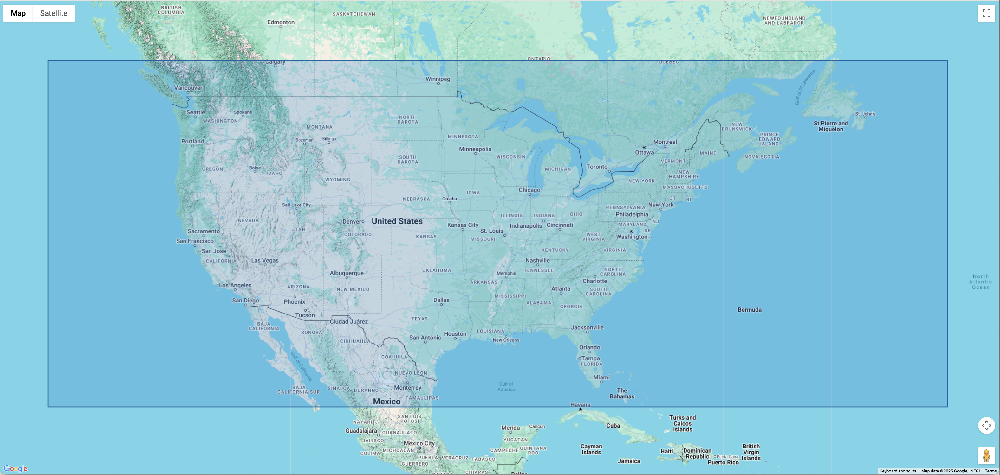

# ERA5 data

The WindWatts team analyzed available wind datasets to advance its mission of supporting the distributed wind energy community. Using high-quality wind speed observations from 304 sites across the United States—spanning a broad range of geographies and measurement heights—the team rigorously evaluated the [ERA5 reanalysis dataset provided by ECMWF](https://www.ecmwf.int/en/forecasts/dataset/ecmwf-reanalysis-v5). The evaluation, focused on the 2015–2023 period, assessed the dataset’s  performance and revealed the following:

- **High temporal fidelity:** ERA5 demonstrated a strong ability to capture hourly wind speed variability, achieving a Pearson correlation coefficient of 0.775 during the 2015–2023 period.
- **Low error:** The mean absolute error (MAE) for ERA5 was 1.58 m/s, indicating close agreement with observed wind speeds across diverse locations and conditions.
- **Minimal bias:** ERA5 exhibited a small positive bias of 0.09 m/s, with an absolute bias of 0.82 m/s. This suggests that modeled wind speeds slightly overestimate observed values on average but remain well within acceptable margins for resource assessment.

Overall, ERA5 provides reliable and well-characterized wind speed estimates for the United States. Its strong temporal resolution, low error, and minimal bias make it a credible and practical resource for distributed wind stakeholders evaluating project opportunities and managing uncertainty in the absence of site-specific data.

## Spatial Coverage

The official [ERA5 data](https://www.ecmwf.int/en/forecasts/dataset/ecmwf-reanalysis-v5) offers global coverage. For WindWatts, we chose to focus on the continental United States to balance usability with data storage and processing efficiency. As a result, current wind resource estimates are provided only for locations within the highlighted region:

## Wind Data and Internal Representation for WindWatts

TBD.
