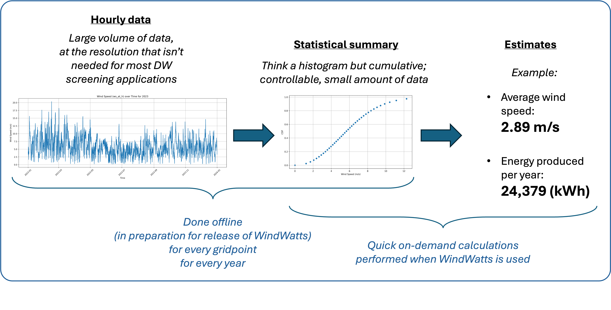

# WindWatts: Data and Capabilities

## ERA5 data

The WindWatts team analyzed available wind datasets to advance its mission of supporting the distributed wind energy community. Using high-quality wind speed observations from 304 sites across the United States—spanning a broad range of geographies and measurement heights—the team rigorously evaluated the [ERA5 reanalysis dataset provided by ECMWF](https://www.ecmwf.int/en/forecasts/dataset/ecmwf-reanalysis-v5). The evaluation, focused on the 2015–2023 period, assessed the dataset’s  performance and revealed the following:

- **High temporal fidelity:** ERA5 demonstrated a strong ability to capture hourly wind speed variability, achieving a Pearson correlation coefficient of 0.775 during the 2015–2023 period.
- **Low error:** The mean absolute error (MAE) for ERA5 was 1.58 m/s, indicating close agreement with observed wind speeds across diverse locations and conditions.
- **Minimal bias:** ERA5 exhibited a small positive bias of 0.09 m/s, with an absolute bias of 0.82 m/s. This suggests that modeled wind speeds slightly overestimate observed values on average but remain well within acceptable margins for resource assessment.

Overall, ERA5 provides reliable and well-characterized wind speed estimates for the United States. Its strong temporal resolution, low error, and minimal bias make it a credible and practical resource for distributed wind stakeholders evaluating project opportunities and managing uncertainty in the absence of site-specific data.

## Spatial Coverage

The official [ERA5 data](https://www.ecmwf.int/en/forecasts/dataset/ecmwf-reanalysis-v5) offers global coverage. For WindWatts, we chose to focus on the continental United States to balance usability with data storage and processing efficiency. As a result, current wind resource estimates are provided only for locations within the highlighted region:

## Quantile-Based Aggregation for Wind Dataset Compression

The WindWatts team has developed a quantile-based aggregation approach to compress large volumes of high-resolution (e.g., hourly) wind data into compact statistical summaries, while preserving accuracy in downstream energy estimates. This method replaces the full hourly dataset with a set of quantile values, dramatically reducing data volume and speeding up tool performance.

The data flow constructed around this approach can be shown as follows:

Additional context and the analysis supporting the choice of this approach are included below.

###  1. Why Quantiles?
Unlike traditional methods such as **12×24 aggregation** (which averages data across 12 months and 24 hours), quantiles **retain the shape of the wind speed distribution**. This makes them significantly better for modeling energy output, which depends non-linearly on wind speed.

### 2. Problems with 12×24 Aggregation
- Intuitive but overly simplistic
- Produces **large errors** in annual energy estimates (as compared to hourly-data-based estimates). The following are averages for >50 sites:
  - **4.5% error** for a small turbine
  - **13.4% error** for a mid-size turbine
  - **28.0% error** for a large turbine
- Fails to preserve the true wind speed distribution (as seen in distorted CDF curves)

### 3. How Quantile-Based Aggregation Works
1. **Select a number of quantiles (e.g., 32–128)** based on desired accuracy/performance tradeoff.
2. **Replace hourly data with quantile values** that approximate the cumulative distribution of wind speeds.
3. **Use quantiles + power curve models** to estimate energy production with high fidelity.

### 4. Performance and Accuracy
- Errors are drastically reduced:
  - Down to **0.1% – 2.6%** in tested examples
- Team's validation across >50 sites confirms that this method does **not introduce significant errors**, even when using a relatively small number of quantiles (32).
- Enables WindWatts to be both **accurate and efficient**, critical for large-scale deployment.

### 5. Comparison Summary

| Method             | Data Size Reduction | Accuracy for Energy Estimation | Preserves Wind Distribution? |
|--------------------|---------------------|-------------------------------|-------------------------------|
| 12×24 Aggregation  | Moderate            | Poor (4–28% error)            | ❌ Distorts distribution      |
| Quantile Method (*supported in WindWatts*)   | High                | Excellent (≤2.6% error)       | ✅ Preserves CDF shape        |
